# 🎬 AppYoutube - Lista de Filmes Pessoal

Aplicativo Android desenvolvido em **Kotlin** para gerenciar uma lista pessoal de filmes com reprodução de trailers do YouTube. Construído com Firebase Authentication, Room Database e Firestore para sincronização na nuvem.

---

## 📋 Funcionalidades

### 1. 🔐 Tela de Login (`WelcomeActivity`)
O usuário pode entrar com e-mail/senha ou conta Google utilizando o FirebaseUI.
**Comportamento:**
- Login com e-mail → fluxo de autenticação via FirebaseUI
- Login com Google → OAuth via Google Sign-In
- Já autenticado → redireciona diretamente para a lista de filmes

### 2. 🎥 Lista de Filmes (`ListaActivity`)
Exibe a lista pessoal de filmes do usuário carregada do Room (local) e Firestore (nuvem).
**Comportamento:**
- FAB `+` → abre dialog para adicionar novo filme com título e link do YouTube
- Cada card exibe título, link, badge de status, botão de play e botão de deletar
- Status alterna entre **Preciso Assistir** e **Já Assisti**
- Botão de sair encerra a sessão e retorna à tela de boas-vindas
- Mensagem de lista vazia quando não há filmes cadastrados

### 3. ▶️ Player de Trailer (`TrailerActivity`)
Abre o trailer do YouTube diretamente no app via WebView.
**Comportamento:**
- Extrai o ID do vídeo do YouTube a partir do link
- Carrega um player HTML com iframe embutido e autoplay
- Suporta pausar/retomar conforme ciclo de vida da activity

### 4. ➕ Dialog de Adicionar Filme (`AdicionarFilmeDialog`)
Dialog para adicionar um novo filme à lista.
**Campos:** Título do filme, link do YouTube
**Comportamento:**
- Campos vazios → exibe Toast de erro
- Dados válidos → salva no Room e no Firestore

---

## 📸 Screenshots

### 🔐 Autenticação
<table>
  <tr>
    <th align="center">Tela de Boas-vindas</th>
    <th align="center">Tela de Login</th>
  </tr>
  <tr>
    <td align="center">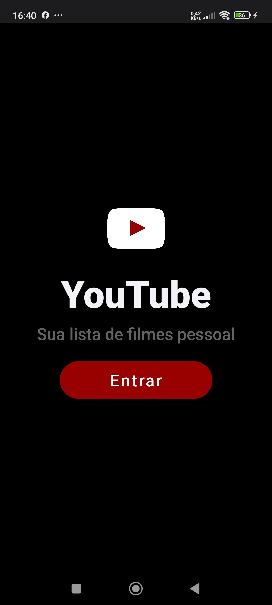</td>
    <td align="center">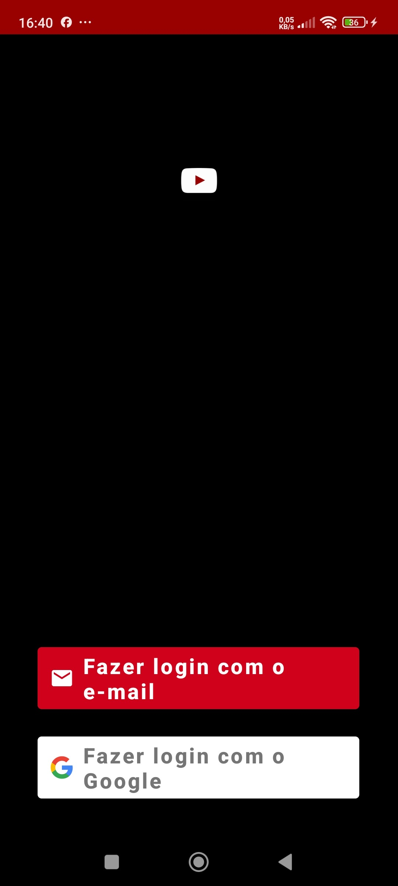</td>
  </tr>
</table>

### 🎬 Lista de Filmes
<table>
  <tr>
    <th align="center">Lista Vazia</th>
    <th align="center">Lista Completa</th>
    <th align="center">Área de Adicionar</th>
  </tr>
  <tr>
    <td align="center">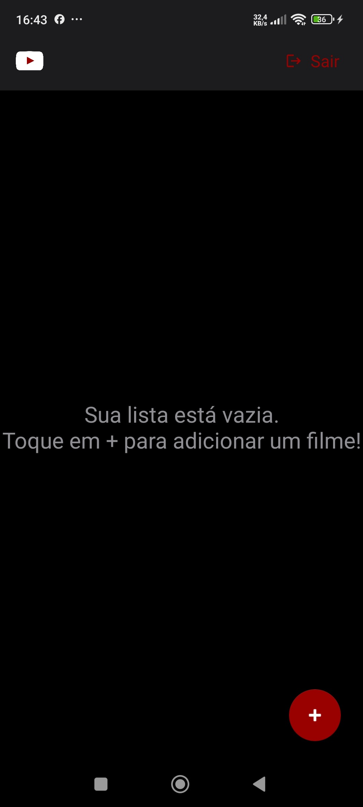</td>
    <td align="center">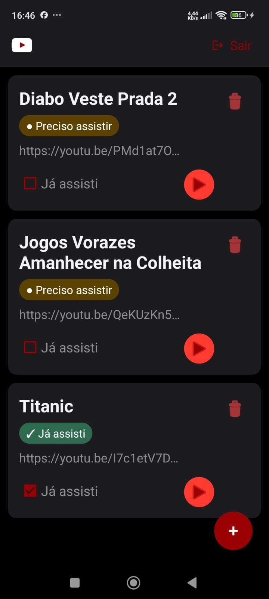</td>
    <td align="center">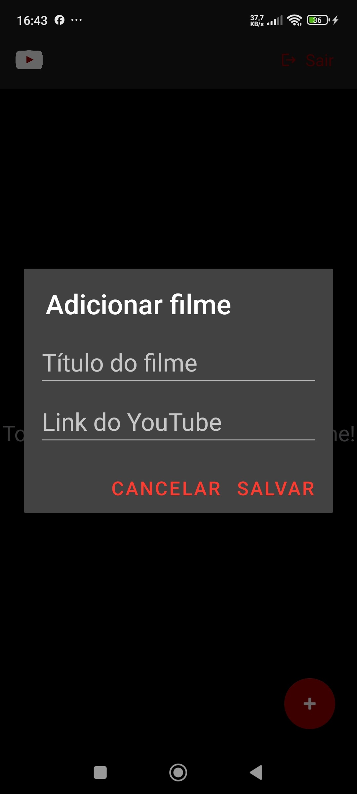</td>
  </tr>
</table>

### ➕ Adicionando Filmes
<table>
  <tr>
    <th align="center">Add Titanic</th>
    <th align="center">Add Jogos Vorazes</th>
    <th align="center">Add Diabo Veste Prada</th>
  </tr>
  <tr>
    <td align="center">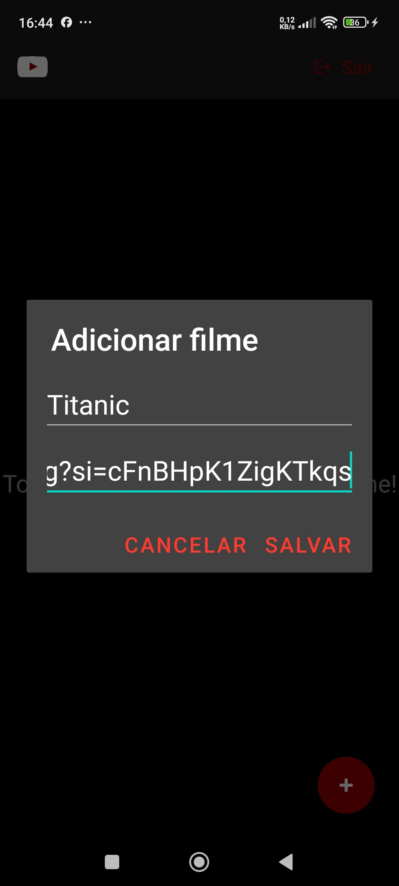</td>
    <td align="center">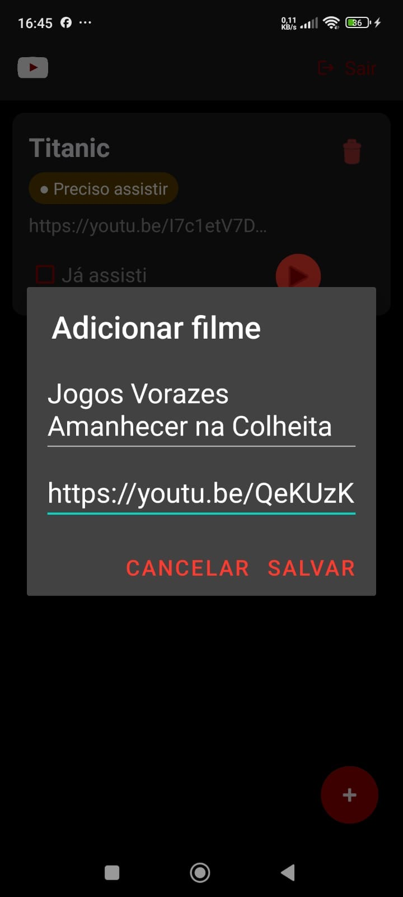</td>
    <td align="center">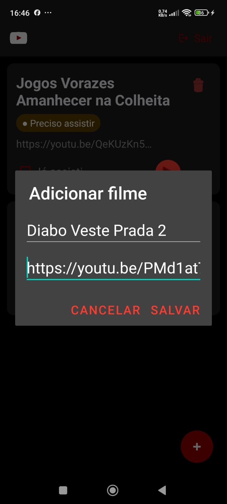</td>
  </tr>
</table>

### ☁️ Banco de Dados Firestore
<table>
  <tr>
    <th align="center">Firestore 1</th>
    <th align="center">Firestore 2</th>
    <th align="center">Firestore 3</th>
  </tr>
  <tr>
    <td align="center">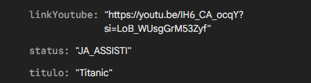</td>
    <td align="center">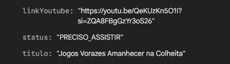</td>
    <td align="center">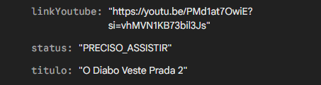</td>
  </tr>
</table>

---

## 🗂️ Estrutura do Projeto

```
app/src/main/
├── java/br/edu/fatecpg/appfirebase/
│   ├── database/
│   │   ├── dao/
│   │   │   └── FilmeDao.kt
│   │   ├── db/
│   │   │   └── AppDatabase.kt
│   │   └── repository/
│   │       └── FilmeRepository.kt
│   ├── model/
│   │   └── Filme.kt
│   └── view/
│       ├── adapter/
│       │   └── FilmeAdapter.kt
│       ├── AdicionarFilmeDialog.kt
│       ├── ListaActivity.kt
│       ├── TrailerActivity.kt
│       ├── WelcomeActivity.kt
│       └── viewmodel/
│           └── FilmeViewModel.kt
└── res/
    ├── drawable/
    │   ├── bg_btn_play.xml
    │   ├── bg_status_assistido.xml
    │   ├── bg_status_pendentes.xml
    │   ├── ic_logout.xml
    │   └── ic_youtube.png
    └── layout/
        ├── activity_lista.xml
        ├── activity_trailer.xml
        ├── activity_welcome.xml
        ├── dialog_adicionar_filme.xml
        └── item_filme.xml
```

---

## 🧩 Modelo de Dados

```kotlin
@Entity(tableName = "filmes")
data class Filme(
    @PrimaryKey(autoGenerate = true)
    val id: Int = 0,
    val firestoreId: String = "",
    val uid: String = "",
    val titulo: String = "",
    val linkYoutube: String = "",
    var status: String = "PRECISO_ASSISTIR"
)
```

---

## 🏗️ Arquitetura

O projeto segue o padrão **MVVM (Model-View-ViewModel)** com as seguintes camadas:

| Camada | Responsabilidade |
|---|---|
| **Model** | Entidade `Filme` mapeada pelo Room |
| **DAO** | Queries SQL via interface anotada (`@Dao`) |
| **Repository** | Abstrai o acesso ao DAO e ao Firestore, centralizando as operações |
| **ViewModel** | Expõe dados via `LiveData`, executa corrotinas com `viewModelScope` |
| **View (Activity)** | Observa o ViewModel e atualiza a interface |

---

## 🛠️ Tecnologias

- **Linguagem:** Kotlin
- **Autenticação:** Firebase Authentication + FirebaseUI
- **Banco local:** Room Database
- **Banco na nuvem:** Cloud Firestore
- **Concorrência:** Coroutines + `viewModelScope` + `Dispatchers.IO`
- **Reatividade:** `LiveData`
- **Reprodução de vídeo:** WebView com iframe do YouTube
- **Componentes de UI:** `RecyclerView`, `CardView`, `CoordinatorLayout`, `AppBarLayout`, `FloatingActionButton`
- **Padrão:** MVVM com Repository Pattern

---

## ▶️ Como executar

1. Clone o repositório:
   ```bash
   git clone https://github.com/seuusuario/AppYoutube.git
   ```
2. Abra o projeto no **Android Studio**
3. Adicione o arquivo `google-services.json` na pasta `app/`
4. Conecte um dispositivo ou inicie um emulador
5. Certifique-se que a **Depuração USB** está ativada no dispositivo
6. Clique em **Run ▶️** (ou `Shift + F10`)
